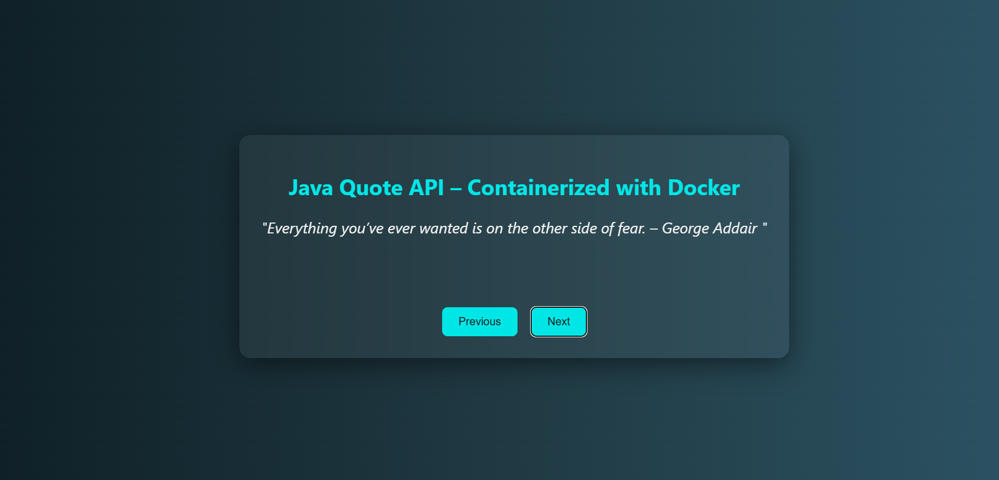

# java-qoutes--app

# Java Motivational Quotes Appi

This project is a simple Java-based HTTP server that serves random motivational quotes via a REST API. The quotes are externalized to a `quotes.txt` file for easy customization.

## 🌟 Features

- 🔥 Random motivational quote via `/api` endpoint
- 🎨 Stylish web UI served at `/`
- 📁 Quotes loaded from `quotes.txt`
- 🐳 Dockerized — run anywhere in seconds

## 🛠️ Requirements

- Java 17+ (only if running without Docker)
- Docker (for containerized deployment)
- Git (to clone the repository)


## Setup and Usage

### Running Locally
1. Clone the repository:
   ```sh
   git clone https://github.com/HarshShah2025/java-quotes-app.git
   cd java-quotes-app
   ```
2. Ensure `quotes.txt` exists in the project directory and contains quotes (one per line).
3. Compile and run the application:
   ```sh
   javac src/Main.java -d out
   java -cp out Main
   ```
4. The server will start on `http://localhost:8000/`.
5. Test the API using:
   ```sh
   curl http://localhost:8000/
   ```

### Running with Docker
1. Build the Docker image:
   ```sh
   docker build -t java-docker-app .
   ```
2. Run the container:
   ```sh
   docker run -p 8000:8000 java-docker-app
   ```
3. Access the API at `http://localhost:8000/`.

## File Structure
```
java-quotes-app/
│
├── Dockerfile
├── quotes.txt # One quote per line
├── index.html # Rich frontend UI
├── README.md
└── src/
└── Main.java # Java HTTP server
```

## Customizing Quotes
To customize the quotes, edit `quotes.txt` and restart the application. Each quote should be on a new line.

## 🖼️ Preview




